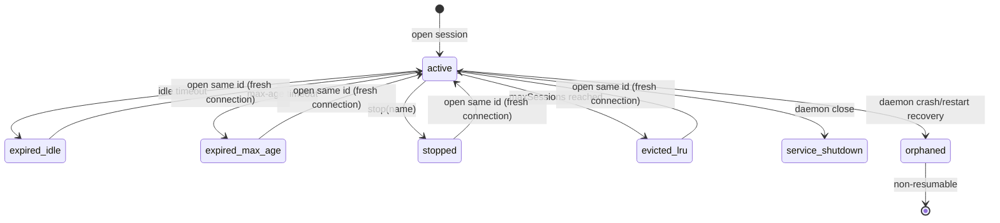

# @mcp-layer/stateful

`@mcp-layer/stateful` manages persistent MCP sessions across CLI invocations. It does session lifecycle only: creation, lookup, execution, listing, stopping, and local metadata persistence.

It does not implement guardrails or plugin policy execution.

## Why this package exists

This package demonstrates resumable session continuity for CLI workflows where reconnecting on every command is too expensive.

Expected behavior: a session id can be reused across commands until it is stopped or expires by policy; opening an expired id closes stale transport handles first and creates a fresh session for that id.

## Installation

```sh
pnpm add @mcp-layer/stateful
```

## Storage contract

Session tracking root:
- `~/.mcp-layer/sessions`

Files:
- `service.json`
- `sessions.json`
- `events.log`

On POSIX systems, the state directory is `0700` and state files are tightened to `0600` (best effort).

IPC endpoint:
- POSIX: `~/.mcp-layer/sessions/stateful.sock`
- Windows: `\\\\.\\pipe\\mcp-layer-stateful-<user-hash>`

The Windows pipe uses a deterministic user-scoped suffix so different local users do not share the same endpoint namespace.

`service.json` also carries the per-process IPC auth token used for local RPC calls.

`events.log` stores lifecycle events only and redacts sensitive fields by key (`token`, `secret`, `password`, `authorization`, `apiKey`) and sensitive string values (for example bearer tokens and common API key formats).

## API Reference

### Client helpers (`src/client.js`)

- `ensureService()`
- `openSession({ name?, server?, config?, transport? })`
- `sessionCatalog({ name })`
- `executeSession({ name, method, params, meta? })`
- `listSessions()`
- `stopSession({ name })`
- `stopAllSessions()`
- `ping()`
- `request(method, params?, options?)`

`request` accepts:
- `options.timeoutMs` (default `3000`)
- `options.maxFrameBytes` (default `1048576`)

Client requests cache service auth metadata per endpoint for lower overhead and auto-refresh once when a request fails with `SESSION_UNAUTHORIZED`.

RPC errors from the service (for example `SESSION_NOT_FOUND`) are propagated via `error.code`.

### Service primitives (`src/service.js`)

- `createService(options?)`
- `runService(options?)`

Service methods exposed over RPC:
- `health.ping`
- `session.open`
- `session.catalog`
- `session.execute`
- `session.list`
- `session.stop`
- `session.stopAll`

### Path helpers (`src/path.js`)

- `root()`
- `serviceFile()`
- `sessionsFile()`
- `eventsFile()`
- `endpoint()`

## Lifecycle defaults

- `idleTimeoutMs`: `1800000` (30m)
- `maxAgeMs`: `28800000` (8h)
- `sweepIntervalMs`: `60000` (60s)
- `maxSessions`: `32`
- `persistIntervalMs`: `250` (session metadata write throttle for high-frequency operations)
- `eventLogMaxBytes`: `1048576` (1 MiB per active `events.log` file before rotation)
- `eventLogMaxFiles`: `3` (retained backups: `events.log.1`, `events.log.2`, `events.log.3`)

Tracked states include:
- `active`
- `expired_idle`
- `expired_max_age`
- `stopped`
- `orphaned`
- `evicted_lru`
- `service_shutdown`

## Lifecycle and ownership model

This section documents expected lifecycle transitions and daemon ownership behavior so operators can reason about restart and recovery paths.



### Daemon ownership

- The first process that listens on the endpoint owns the daemon.
- A second listener attempt fails with `SESSION_SERVICE_RUNNING` and must not overwrite ownership metadata.
- Client `ensureService()` reuses a healthy daemon and only spawns when ping fails.

### Timeout and eviction behavior

- Every successful `catalog`/`execute` refreshes `lastActiveAt` and `expiresAt`.
- Idle expiry and max-age expiry close transport handles and move state to `expired_idle`/`expired_max_age`.
- Capacity enforcement uses LRU among `active` sessions when `maxSessions` is exceeded.
- Persist writes are throttled by `persistIntervalMs` for hot paths and forced for lifecycle transitions.

## Recovery runbook

### Stale or orphaned sessions after restart

1. List local sessions: `mcp-layer session list --format json`.
2. Stop stale ids (`session stop --name <id>`) or clear all (`session stop --all`).
3. Re-open a new or same session id to create a fresh transport.
4. Treat `SESSION_ORPHANED` as non-resumable and reopen.

### Daemon endpoint ownership conflicts

1. Inspect `~/.mcp-layer/sessions/service.json` for owner pid/token metadata.
2. Verify owner process health before taking action.
3. Stop unhealthy owner process and restart session activity.
4. Retry operation after daemon ownership is restored.

## Local storage hygiene

- Safe to delete when no daemon is running: `sessions.json`, `events.log`, and stale socket files.
- Do not edit `service.json` while daemon is active; it contains live auth token material for local RPC.
- Keep directory permissions user-only (`0700`) and avoid copying this directory between hosts/users.
- Event logs rotate automatically by size with bounded backup count to prevent unbounded local growth.

## Runtime Error Reference

Errors are `LayerError` instances with stable codes.

<a id="error-f077cf"></a>
### Unable to start stateful session service.

Thrown from: `ensureService`

Step-by-step resolution:
1. Check that the IPC endpoint path under `~/.mcp-layer/sessions` is writable.
2. Verify no stale process is holding the socket/pipe endpoint.
3. Inspect local process limits and startup logs for spawn failures.
4. Retry after clearing stale endpoint files and restarting the command.

<details>
<summary>Fix Example: clear stale endpoint metadata</summary>

```sh
rm -f ~/.mcp-layer/sessions/stateful.sock
```

</details>

<a id="error-dce84f"></a>
### Stateful service endpoint is already active.

Thrown from: `listen`

Step-by-step resolution:
1. Reuse the existing stateful daemon instead of starting a second instance.
2. If the existing daemon is unhealthy, stop it first and then retry startup.
3. Verify no orphan process is still bound to `~/.mcp-layer/sessions/stateful.sock` (or the Windows named pipe).
4. Retry once endpoint ownership is clear.

<details>
<summary>Fix Example: inspect and stop active daemon owner</summary>

```sh
cat ~/.mcp-layer/sessions/service.json
kill <pid>
```

</details>

<a id="error-1dbb92"></a>
### Multiple servers found. Provide --server <name>.

Thrown from: `open`

Step-by-step resolution:
1. Inspect resolved config and list available server names.
2. Choose one explicit server name for the session open call.
3. Pass `--server <name>` for CLI commands or `server` in API calls.
4. Retry session open.

<details>
<summary>Fix Example: open session with explicit server selection</summary>

```sh
mcp-layer session --server demo tools echo --text "hello"
```

</details>

<a id="error-e95523"></a>
### Server "{server}" was not found.

Thrown from: `open`

Step-by-step resolution:
1. Validate the requested server key exists in the resolved config.
2. Confirm the intended config file/directory is being loaded.
3. Correct the server name or config source.
4. Retry session open.

<details>
<summary>Fix Example: list then select server</summary>

```sh
mcp-layer servers list
mcp-layer session --server demo tools echo --text "hello"
```

</details>

<a id="error-fae4d2"></a>
### Session "{session}" was not found.

Thrown from: `active`

Step-by-step resolution:
1. Run `session list` and verify the session id exists.
2. Confirm the same user home directory is used across commands.
3. Re-open a new session if the id does not exist.
4. Retry the operation with a valid session id.

<details>
<summary>Fix Example: validate session id before execution</summary>

```sh
mcp-layer session list --format json
mcp-layer session --name <id> tools echo --text "hello"
```

</details>

<a id="error-112193"></a>
### Session "{session}" is orphaned and cannot be resumed.

Thrown from: `active`

Step-by-step resolution:
1. Treat orphaned sessions as non-resumable after service crash/restart.
2. Stop the orphaned session id to clean metadata.
3. Open a fresh session id and continue execution.
4. Update callers to handle `SESSION_ORPHANED` with a reopen flow.

<details>
<summary>Fix Example: reopen after orphaned marker</summary>

```sh
mcp-layer session stop --name <id>
mcp-layer session tools echo --text "hello"
```

</details>

<a id="error-8400ee"></a>
### Session "{session}" is not active.

Thrown from: `active`

Step-by-step resolution:
1. Check session status from `session list`.
2. If status is non-active, stop it and open a new session.
3. Ensure lifecycle sweeper settings match expected session duration.
4. Retry with an active session id.

<details>
<summary>Fix Example: replace inactive session id</summary>

```sh
mcp-layer session stop --name <id>
mcp-layer session tools echo --text "hello"
```

</details>

<a id="error-1f0123"></a>
### Session "{session}" expired due to inactivity.

Thrown from: `active`

Step-by-step resolution:
1. Confirm idle timeout settings for the stateful service.
2. Re-open session when idle expiry is expected.
3. Increase `idleTimeoutMs` if workloads require longer idle windows.
4. Add keepalive/heartbeat operations for long interactive pauses.

<details>
<summary>Fix Example: reopen after idle timeout</summary>

```sh
mcp-layer session tools echo --text "resume"
```

</details>

<a id="error-23ec53"></a>
### Session "{session}" expired due to max age policy.

Thrown from: `active`

Step-by-step resolution:
1. Confirm configured `maxAgeMs` for the service process.
2. Re-open a new session when max-age is reached.
3. Increase max-age only if policy allows longer-lived sessions.
4. Ensure clients surface this as a deterministic non-resume path.

<details>
<summary>Fix Example: rotate to a fresh session</summary>

```sh
mcp-layer session tools echo --text "new session"
```

</details>

<a id="error-aaae6d"></a>
### Session "{session}" is orphaned and cannot be resumed.

Thrown from: `open`

Step-by-step resolution:
1. Avoid reusing ids that were persisted as orphaned.
2. Stop and clear the orphaned id record.
3. Open a new generated or explicit session id.
4. Update callers to recreate sessions on this code.

<details>
<summary>Fix Example: move to a new id</summary>

```sh
mcp-layer session stop --name <id>
mcp-layer session --name fresh-1 tools echo --text "hello"
```

</details>

<a id="error-e880fb"></a>
### Session name is required for stop.

Thrown from: `stop`

Step-by-step resolution:
1. Supply `--name <id>` for targeted stop.
2. Use `--all` when intent is to stop all active sessions.
3. For automation, always pass explicit stop intent.
4. Retry stop with one of the valid forms.

<details>
<summary>Fix Example: explicit stop modes</summary>

```sh
mcp-layer session stop --name alpha
mcp-layer session stop --all
```

</details>

<a id="error-c37ac2"></a>
### Session "{session}" was not found.

Thrown from: `stop`

Step-by-step resolution:
1. List sessions to confirm the id exists.
2. Ignore if already removed or expired.
3. Clean caller state that references stale ids.
4. Retry only with an existing id.

<details>
<summary>Fix Example: stop an existing id only</summary>

```sh
mcp-layer session list --format json
mcp-layer session stop --name <existing-id>
```

</details>

<a id="error-1a3e53"></a>
### Unknown RPC method "{method}".

Thrown from: `dispatch`

Step-by-step resolution:
1. Verify the client calls one of the supported RPC methods.
2. Update callers after any service method contract change.
3. Reject typos in method strings before dispatch.
4. Retry with a valid method name.

<details>
<summary>Fix Example: supported RPC method names</summary>

```js
await request('session.open', { name: 'alpha' });
await request('session.execute', { name: 'alpha', method: 'tools/call', params: {} });
```

</details>

<a id="error-b6850a"></a>
### RPC frame exceeds maximum allowed size.

Thrown from: `request`

Step-by-step resolution:
1. Reduce response payload size from the stateful service endpoint.
2. Increase `request(..., { maxFrameBytes })` when larger payloads are expected.
3. Ensure clients stream large outputs instead of returning single oversized frames.
4. Retry after sizing limits and payload behavior are aligned.

<details>
<summary>Fix Example: increase client frame limit for expected payloads</summary>

```js
await request('session.execute', payload, { maxFrameBytes: 2 * 1024 * 1024 });
```

</details>

## Testing

```sh
pnpm --filter @mcp-layer/stateful test
```

Tests use `node:test` with real `@mcp-layer/test-server` sessions and cover open/reuse, execution, listing, stop behavior, idle expiry (including lazy expiry checks), and LRU eviction.
